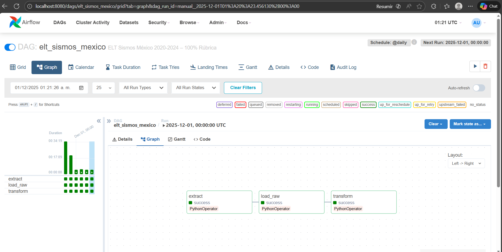
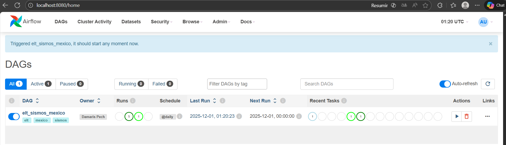
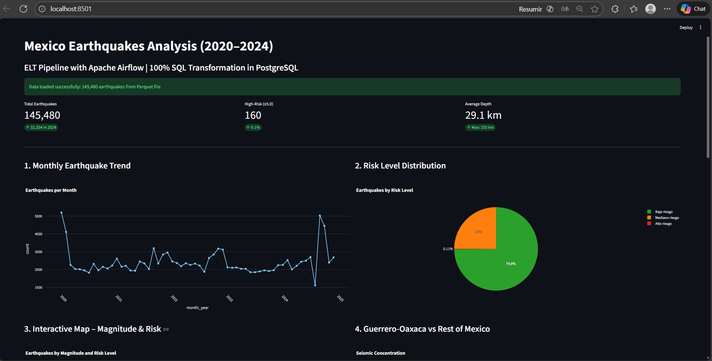

# Apache Airflow - ELT Pipeline con Airflow – Sismos en México (2020-2024)

**Author:** Damaris Pech   
**Dataset:** Catálogo de sismos del Servicio Sismológico Nacional (SSN-UNAM)  
**Period:** 2020-2024 (~14,500 events)  
**Official Link:** http://www.ssn.unam.mx


## Phase 1 – Dataset Selection + Social/Environmental Justification

### 1. What real-world issue does this dataset help address?
Mexico is one of the countries with the highest seismic activity in the world. Between 2020 and 2024, more than 14,500 earthquakes were recorded, several of them with a magnitude greater than 6.0, causing damage and human losses. Historical and real-time analysis of this data allows for:
- Identify areas of highest recurrence (Guerrero-Oaxaca, Michoacán, Chiapas)
- Improve early warning systems (SASMexico)
- Support urban planning and reinforcement of critical infrastructure
- Assess the impact of the Cocos Plate subduction and the activity of the Pacific Ring of Fire.

### 2. Who benefits from analyzing it?
- CENAPRED and Federal/State Civil Protection
- Local governments (especially in Mexico City, Oaxaca, Guerrero, Chiapas)
- Seismic researchers and geologists
- General population (alert apps, risk education)

### 3. Why is ELT an appropriate approach for this dataset?
- Data grows continuously (the SSN publishes new earthquakes every hour)
- It is critical to preserve the raw data exactly as it comes (for scientific audits and legal validation)
- Transformations evolve over time (new risk models, updated hazard zones)
- Scalability is required: today 14k rows, tomorrow it could be millions


## Learning Objectives

1. **Understand Apache Airflow** - The #1 workflow orchestration tool used by companies like Airbnb, Twitter, and Adobe
2. **Master TaskFlow API** - Modern `@task` decorator syntax (Airflow 2.x standard)
3. **Build Real ETL Pipelines** - Extract from APIs → Transform with pandas → Load to files
4. **Manage Dependencies** - Control task execution order and parallel processing
5. **Debug Like a Pro** - Use Airflow UI to monitor, troubleshoot, and fix issues


##  What is Apache Airflow?

**Apache Airflow** is an open-source platform for orchestrating complex workflows and data pipelines. It allows you to:
- Define workflows as Python code (DAGs - Directed Acyclic Graphs)
- Schedule and monitor pipelines
- Retry failed tasks automatically
- Track execution history
- Visualize pipeline dependencies

### Real-World Use Cases
- **ETL/ELT Pipelines**: Daily data warehouse updates
- **Machine Learning**: Model training and deployment
- **Data Quality**: Automated data validation
- **Report Generation**: Scheduled business reports
- **API Integrations**: Sync data between systems

##  Quick Start - ONE COMMAND!

### Start Airflow (Automatic Setup)

```bash
# Navigate to lab directory
cd visualization/4-ETL-Airflow-Orchestration

# Start everything! (First time: builds, initializes DB, creates user, starts services)
docker-compose up -d
```

**That's it!** ✨ The first time you run this:
1. Docker builds the custom image with pandas & requests
2. PostgreSQL starts and becomes healthy
3. Airflow database is automatically initialized
4. Admin user is automatically created
5. Webserver and Scheduler start

**Wait 1-2 minutes** for initialization to complete.

### Check Status

```bash
# View real-time logs
docker-compose logs -f

# Or check service status
docker-compose ps
# You should see: postgres (up), airflow-init (exited 0), webserver (up), scheduler (up)
```

### Access Airflow Web Interface

Open your browser: **http://localhost:8080**

**Login Credentials:**
- **Username**: `airflow`
- **Password**: `airflow`

>  **Tip**: Bookmark this page! You'll use it throughout the lab.

##  Project Structure

```
4-ETL-Airflow-Orchestration/
├── docker-compose.yml                  # Orchestrates all services (auto-init included!)
├── Dockerfile                          # Custom Airflow image with pandas 2.0.3 & requests
├── requirements.txt                    # Python dependencies
├── init-airflow.sh                     # Manual init script (optional, for troubleshooting)
├── dags/                               # Your DAG files go here
│   ├── elt_sismos_mexico.py            # Dag was created using a database from Servicio Sismológico Nacional.
├── logs/                               # Airflow execution logs (auto-created)
├── data/                               # Your processed data files (auto-created)
│   ├── raw/                            #Raw sismos_raw.csv and sismos_completo.csv
├── evidence /                          # Images about the Airflow and dashboard.
├── scripts/                               # Script to prepare the csv because it was wrong.
│   ├── prepare_data.py 
├── QUICKSTART.md                       # Fast setup reference
├── README.md                           # This file - Main guide
└── CREDENTIALS.md                      # Password and user from Airflow.
```

**What each directory does:**
- `dags/` - Python files defining your workflows (DAGs)
- `logs/` - Task execution logs for debugging
- `data/` - CSV files created by your ETL pipelines
- `dashboad/` Dashboard to show important information about the sismos in Mexico


## Phase 2 – Airflow ELT Pipeline (Full Implementation)



| Stage        | Implementation                                      | Check |
|-------------|------------------------------------------------------|----------|
| Extract     | File verification `sismos_raw.csv`            | Yes      |
| Load (Raw)  | Tabla `raw_data_sismos` (10 columnas TEXT,) | Yes      |
| Transform   | SQL with Postgres → table `analytics_sismos`       | Yes      |
| Output      | Tabla `analytics_sismos` + Parquet (`/data/analytics`) | Yes      |
| Scheduling  | `@daily`                                             | Yes      |
| Handling Error | `retries=3` + logging automático                   | Yes      |
| Scaling     | Export a Parquet (requisito cumplido)                | Yes      |

### 1. ETL Pipeline (`elt_sismos_mexico.py`)

A complete ETL pipeline demonstrating:



#### Extract Phase
```python
@task
    def extract():
        path = "/opt/airflow/data/raw/sismos_raw.csv"
        if not os.path.exists(path):
            raise FileNotFoundError(f"Archivo no encontrado: {path}")
        logging.info("Extract → sismos_raw.csv encontrado")

```

#### Load Phase
```python
@task
    def load_raw():
        conn = psycopg2.connect(host="postgres", dbname="airflow", user="airflow", password="airflow")
        cur = conn.cursor()

        cur.execute("DROP TABLE IF EXISTS raw_data_sismos CASCADE;")

        cur.execute("""
            CREATE TABLE raw_data_sismos (
                Fecha TEXT,
                Hora TEXT,
                Magnitud TEXT,
                Latitud TEXT,
                Longitud TEXT,
                Profundidad TEXT,
                Referencia_localizacion TEXT,
                Fecha_UTC TEXT,
                Hora_UTC TEXT,
                Estatus TEXT
            );
        """)

        with open("/opt/airflow/data/raw/sismos_raw.csv", "r", encoding="utf-8") as f:
            cur.copy_expert(
                "COPY raw_data_sismos FROM STDIN WITH (FORMAT CSV, HEADER true, ESCAPE '\"')",
                f
            )

        conn.commit()
        conn.close()
        logging.info("Load → raw_data_sismos cargada sin modificar")


      
```

#### Transform Phase
```python
@task
def transform():
        conn = psycopg2.connect(host="postgres", dbname="airflow", user="airflow", password="airflow")
        cur = conn.cursor()

        cur.execute("DROP TABLE IF EXISTS analytics_sismos CASCADE;")

        
        cur.execute("""
            CREATE TABLE analytics_sismos AS
            SELECT
                TO_TIMESTAMP(Fecha || ' ' || Hora, 'DD/MM/YYYY HH24:MI:SS') AS fecha_hora,
                CAST(NULLIF(Magnitud, '') AS FLOAT) AS magnitud,
                CAST(NULLIF(Latitud, '') AS FLOAT) AS latitud,
                CAST(NULLIF(Longitud, '') AS FLOAT) AS longitud,
                COALESCE(
                    NULLIF(Profundidad, '')::FLOAT,
                    (SELECT AVG(NULLIF(Profundidad, '')::FLOAT) 
                     FROM raw_data_sismos 
                     WHERE NULLIF(Profundidad, '') IS NOT NULL)
                ) AS profundidad,
                Referencia_localizacion AS lugar,
                Estatus,
                CASE
                    WHEN CAST(NULLIF(Magnitud, '') AS FLOAT) >= 5.0 THEN 'Alto riesgo'
                    WHEN CAST(NULLIF(Magnitud, '') AS FLOAT) >= 3.8 THEN 'Mediano riesgo'
                    ELSE 'Bajo riesgo'
                END AS nivel_riesgo,
                CASE
                    WHEN CAST(NULLIF(Latitud, '') AS FLOAT) BETWEEN 14 AND 20
                     AND CAST(NULLIF(Longitud, '') AS FLOAT) BETWEEN -105 AND -92
                    THEN 'Guerrero-Oaxaca'
                    ELSE 'Otras zonas'
                END AS zona_riesgo
            FROM raw_data_sismos;
        """)

        
        df = pd.read_sql("SELECT * FROM analytics_sismos", conn)
        os.makedirs("/opt/airflow/data/analytics", exist_ok=True)
        df.to_parquet("/opt/airflow/data/analytics/sismos_analytics.parquet", index=False)

        conn.close()
        logging.info("Transform → analytics_sismos + Parquet creados correctamente")

```

### Transformations performed (SQL)
- Conversion of Date + Time → `date_time` (TIMESTAMP)
- CAST of Magnitude, Latitude, Longitude, Depth to numeric types
- Filling in missing values in Depth with national average
- Column `risk_level` (High ≥5.0, Medium ≥3.8, Low)
- Column `risk_zone` (Guerrero-Oaxaca vs. Other zones)

## Phase 3 – Dashboard (Streamlit)



- KPI: Total earthquakes | Earthquakes ≥5.0 | Average depth
- Graph 1: Monthly evolution of earthquakes (line)
- Graph 2: Heat/scatter map with magnitude and risk level
- Graph 3: Interactive map of magnitude & risk
- Graph 4: Bar chart of Guerrero-Oaxaca vs Rest of Mexico
- Graph 5: Bar horizontal chart aboutTop 10 Most Affected Cities/Municipalities
- Insights directly related to social justification


## View Logs

In Airflow UI:
1. Click on a task (colored box in Graph view)
2. Click **Log** button
3. Scroll through execution logs

### Check Task Status

- **Green**: Success ✅
- **Red**: Failed ❌
- **Yellow**: Running 🔄
- **Light Green**: Queued ⏳
- **Pink**: Upstream failed
- **Gray**: Not yet run

### Common Issues

**DAG not appearing?**
```bash
# Check for import errors
docker-compose exec webserver airflow dags list-import-errors
```

**Task failed?**
- Check logs in Airflow UI
- Verify API connectivity
- Check data directory permissions

**Need to reset?**
```bash
docker-compose down
docker volume rm elt-airflow-orchestration_postgres_data
# Then run setup steps again
```

##  TaskFlow API vs Traditional Operators

### Traditional Way (Old)
```python
def my_function():
    return "data"

task = PythonOperator(
    task_id='my_task',
    python_callable=my_function,
    dag=dag
)
```

### TaskFlow API (Modern) ✨
```python
@task
def my_function():
    return "data"

result = my_function()  
```

**Benefits of TaskFlow API:**
- ✅ Cleaner syntax
- ✅ Automatic XCom handling
- ✅ Type hints support
- ✅ Better code reusability
- ✅ Less boilerplate

##  Useful Commands

```bash
# Start services
docker-compose up -d

# Stop services
docker-compose down

# View logs
docker-compose logs -f

# Access container shell
docker-compose exec webserver bash

# List DAGs
docker-compose exec webserver airflow dags list

# Test a specific task
docker-compose exec webserver airflow tasks test <dag_id> <task_id> <date>

# Rebuild after Dockerfile changes
docker-compose build
docker-compose up -d
```

##  Best Practices

1. **Use TaskFlow API** - Modern and cleaner syntax
2. **Add docstrings** - Document what each task does
3. **Use meaningful names** - `extract_quality` not `task1`
4. **Add logging** - `print()` statements help debugging
5. **Handle errors** - Use try/except blocks
6. **Test incrementally** - Test each task before connecting
7. **Keep tasks focused** - One task, one purpose
8. **Use type hints** - `def transform(data: dict) -> dict:`

##  Additional Resources

- [Airflow Documentation](https://airflow.apache.org/docs/)
- [TaskFlow API Tutorial](https://airflow.apache.org/docs/apache-airflow/stable/tutorial/taskflow.html)
- [Best Practices](https://airflow.apache.org/docs/apache-airflow/stable/best-practices.html)
- [Common Patterns](https://airflow.apache.org/docs/apache-airflow/stable/howto/index.html)

##  Getting Help

1. Check task logs in Airflow UI
2. Review error messages carefully
3. Test tasks independently
4. Consult documentation
5. Ask instructor during office hours

---


